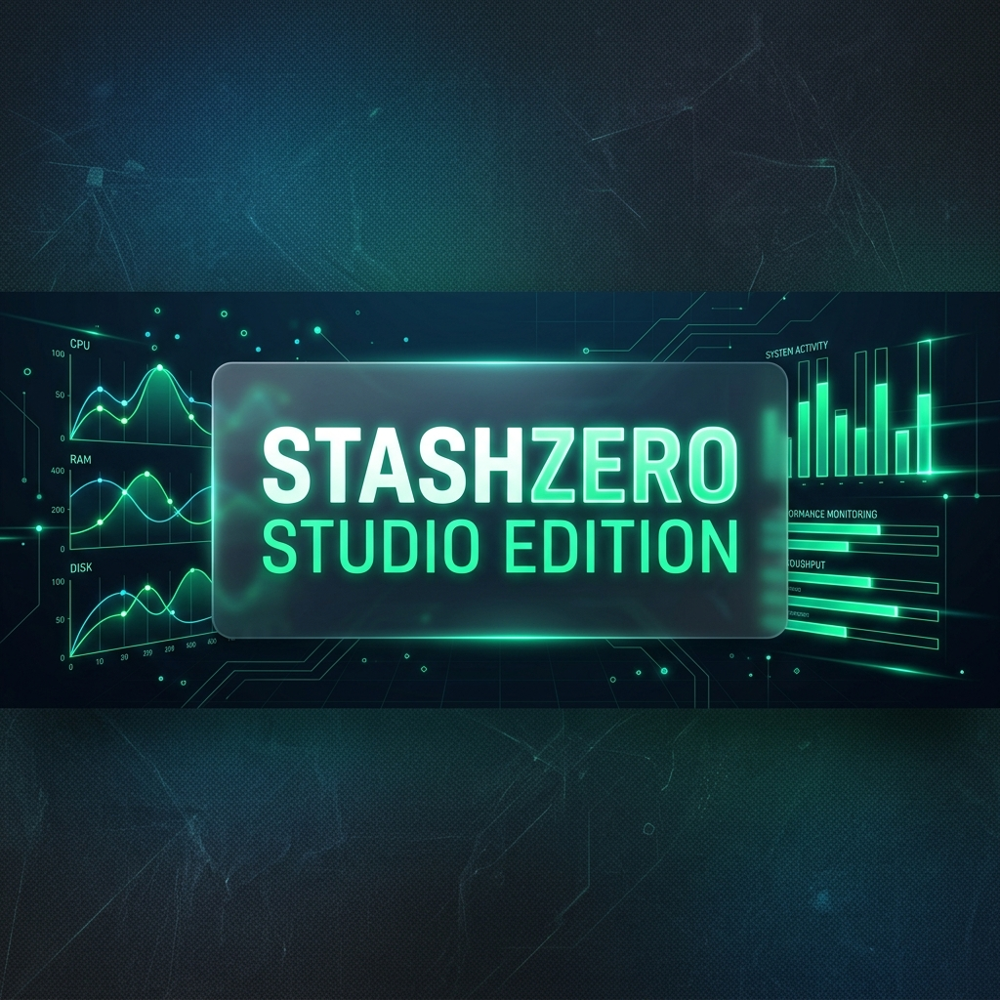

# 
💎 StashZero: Studio Edition

  

  <b>Bilgisayarınız İçin En Modern ve Hızlı Uygulama Merkezi.</b> 
  <i>Yüzlerce uygulamayı saniyeler içinde, reklamlarla uğraşmadan ve tek tıkla kurun.</i>

  
  
  

---

## 🌌 StashZero Nedir?

**StashZero Studio Edition**, bilgisayarınıza format attıktan sonra veya yeni bir uygulama ihtiyacınız olduğunda imdadınıza yetişen **hepsi bir arada** bir yükleme merkezidir. Tarayıcıda tek tek site gezme, reklam bekleme veya yanlış butona basma derdine son verir. En popüler uygulamaları sizin için tek bir şık arayüzde toplar.

## ✨ Sizin İçin Neler Sunuyor?

### 🚀 Tek Tıkla Sessiz Kurulum
Uygulamaları seçin ve "Kurulumu Başlat" butonuna basın. StashZero, kurulum dosyalarını indirir ve sizin yerinize "İleri, İleri, Son" adımlarını otomatik olarak (sessizce) yapar.

### 📊 Akıllı Sistem İzleme (Telemetri)
Uygulama yüklenirken bilgisayarınızın ne kadar yorulduğunu merak ediyor musunuz?
- **Anlık Kaynak Takibi:** İşlemci (CPU), Bellek (RAM) ve Disk kullanımını şık grafiklerle izleyin.
- **İndirme Hızı:** İnternetinizin gerçek indirme hızını anlık olarak görün.
- **Detaylı Bilgi:** Bilgisayarınızın ana kartından işletim sistemi sürümüne kadar her detayı tek ekranda görün.

### 🎨 Görsel Şölen (Studio Tasarımı)
Sıkıcı ve eski görünen pencereleri unutun.
- **Modern Cam Tasarımı:** Derinlik hissi veren, yarı saydam ve göz alıcı bir arayüz.
- **Kategorize Edilmiş Kütüphane:** Oyunlar, Tarayıcılar, AI Araçları ve daha fazlası... Aradığınızı saniyeler içinde bulun.

---

## 🛠️ Nasıl Kullanılır?

1.  **Göz Atın:** Sol menüdeki kategorilerden ihtiyacınız olan programları bulun.
2.  **Seçin:** İstediğiniz programların üzerine tıklayarak seçiminizi yapın.
3.  **Keyfini Çıkarın:** En alttaki **"Sessiz Kurulum Başlat"** butonuna basın ve StashZero sizin yerinize her şeyi halletsin.

---

## 🛡️ Güvenli ve Hızlı
StashZero, uygulamaları doğrudan **resmi kaynaklarından veya güvenilir açık kaynak depolarından** indirir. Aracı sitelerin eklediği reklam yazılımları veya bloatware'ler ile asla uğraşmazsınız.

---

## 🖥️ Sistem Gereksinimleri
- **İşletim Sistemi:** Windows 10 veya Windows 11
- **Ekran Kartı:** Donanım hızlandırmalı modern bir grafik kartı (Görsel efektler için önerilir)

---

## 👨‍💻 Geliştirici
**StashZero Studio Edition**, **byGOG** tarafından profesyonel kullanıcı deneyimi için geliştirilmiştir.

---

  <i>Bilgisayarınızı yönetmek hiç bu kadar keyifli olmamıştı.</i> 
  © 2026 byGOG Software. Tüm hakları saklıdır.

